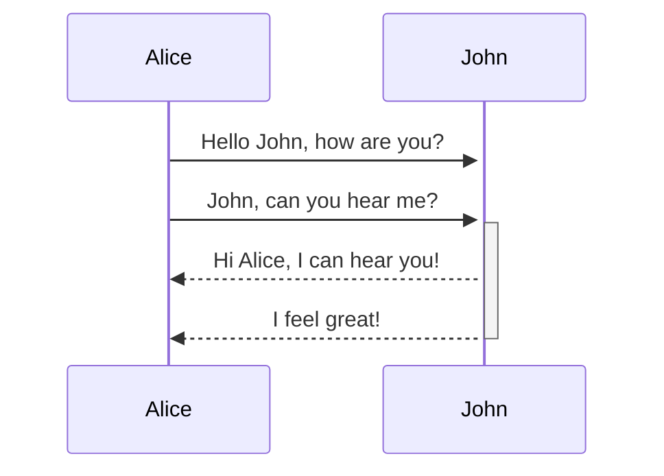
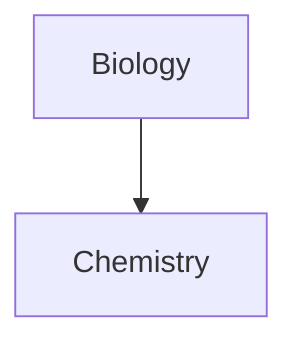

# `= this.file.link`
>[!Properties]- |  `= this.Parent.Parent.Parent` | `= this.Parent.Parent` | `= this.Parent` | `= this.file.link` | `BUTTON[note]` 
>Version:: 3
>Parent:: [[How To]]
>Tags:
```meta-bind-embed
[[Search note]]
```
Source::
Related To::
***
# Examples





# Foot
```meta-bind-embed
[[Foot note]]
``` 